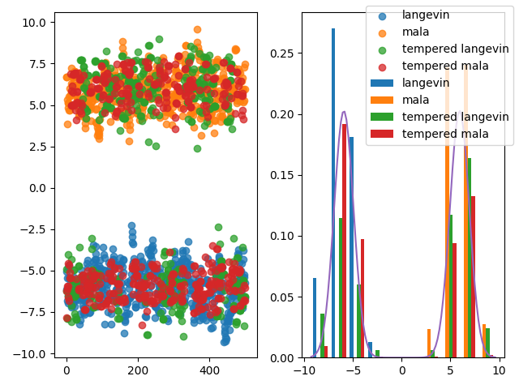

# The mcmc module
This module contains a variety of MCMC samplers which can be used to fit
the energy model. While the [Langevin dynamics](langevin.py) and the
[Metropolis Adjusted Langevin Algorithm](mala.py) samplers are both quite
fast, they struggle to capture all the modes in the distribution. Thus, for
multi-modal distribution they should either
 1. be used with a large number of parallel chains, persistent samples should reset
 occasionally, and/or
 2. be used with [Tempered Transitions](tempered_transitions.py) 
 (cf. [Neal](https://link.springer.com/article/10.1007/BF00143556)).
 
A comparison of these MCMC schemes can be seen for a mixture of gaussians in
the plot below:

Notice that only when used with tempered transitions are both modes adequately 
explored.